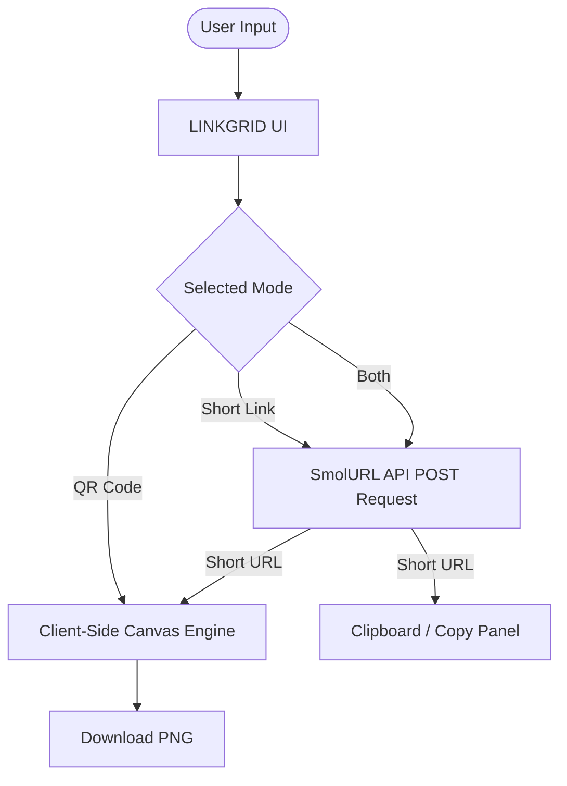

# LINKGRID

**LINKGRID** is a lightweight, zero-build, client-side web application that transforms links and text strings into custom, high-resolution QR codes and shortened URLs directly inside your browser.

---

## Features

- **Client-Side Rendering:** Core QR code generation, error correction, logo embedding, and PNG rendering are performed entirely in your browser canvas. No URLs or images leave your machine during QR generation.
- **Three Operation Modes:**
  - `QR code`: Pure client-side generation for any URL, text string, Wi-Fi configuration, or vCard.
  - `Short link`: Fast URL shortening powered by the public [SmolURL](https://smolurl.com) API.
  - `Both`: Hybrid mode that shortens the target link and immediately produces a custom QR code pointing to the new short URL.
- **Deep Customization:**
  - **Color Control:** Interactive color pickers for both module (foreground) and field (background) colors.
  - **Pixel-Perfect Scaling:** Integer module multipliers eliminate blurry sub-pixel antialiasing across export sizes (160px–480px).
  - **Logo Embedding:** Upload any logo image to automatically embed it in the center of the QR code with module-aligned background cutouts and automatic upgrade to High Error Correction (Level H, ~30% recovery).
  - **Dynamic Tab Favicon:** Dynamically syncs the browser tab's favicon with your active uploaded logo.
- **Export Ready:** One-click crisp PNG downloads (`linkgrid-qr.png`) and one-click clipboard copy for shortened links.
- **Optional Firebase Authentication:** Integrated Google Sign-In interface built on Firebase v10.13.0 for authenticated user sessions.

---

## Quick Start

LINKGRID requires no build pipelines, compilers, or package managers:

1. **Clone the repository:**
   ```bash
   git clone https://github.com/Vedd023/LINKGRID.git
   cd LINKGRID
   ```

2. **Open the application:**
   - Double-click [index.html](file:///c:/Users/Ved%20Dixit/OneDrive/Desktop/LINKGRID/index.html) to open directly in any modern browser, or
   - Serve locally with a static web server:
     ```bash
     python -m http.server 8000
     # Or using Node
     npx serve .
     ```
   - Open `http://localhost:8000` in your web browser.

---

## Architecture & Data Flow



### Network Transparency & External Services
- **QR Generation:** Completely offline-capable and client-side.
- **URL Shortener:** In "Short link" and "Both" modes, the target URL is transmitted via HTTPS POST to `https://smolurl.com/api/links`.
- **Authentication:** Google OAuth sign-in connects to Google Firebase services if configured.

---

## Repository Structure

```
LINKGRID/
├── index.html                  # Main application interface and client logic
├── dashboard.html              # Standalone admin dashboard interface
├── qr.js                       # Bundled minified QRCode.js library
├── README.md                   # Project overview and quick start
├── CONTRIBUTING.md             # Contribution guidelines and development workflow
├── CHANGELOG.md                # Version history and release notes
├── SECURITY.md                 # Security policy, data flow scope, and reporting
├── .gitignore                  # Git ignore rules for OS and editor artifacts
└── docs/
    ├── USER_GUIDE.md           # Step-by-step usage, customization, and troubleshooting
    ├── THIRD_PARTY_NOTICES.md  # Attribution and licenses for bundled libraries & fonts
    └── KNOWN_ISSUES.md         # Documented technical limitations and edge cases
```

---

## Documentation

For comprehensive guides and technical documentation, refer to the `docs/` folder:

- [User Guide](file:///c:/Users/Ved%20Dixit/OneDrive/Desktop/LINKGRID/docs/USER_GUIDE.md) — Comprehensive guide to configuration, modes, error correction, and troubleshooting.
- [Known Issues & Technical Considerations](file:///c:/Users/Ved%20Dixit/OneDrive/Desktop/LINKGRID/docs/KNOWN_ISSUES.md) — Verified technical nuances, network dependencies, and browser constraints.
- [Third-Party Notices](file:///c:/Users/Ved%20Dixit/OneDrive/Desktop/LINKGRID/docs/THIRD_PARTY_NOTICES.md) — Attribution and license details for QRCode.js, Google Fonts, Firebase SDK, and external APIs.
- [Security Policy](file:///c:/Users/Ved%20Dixit/OneDrive/Desktop/LINKGRID/SECURITY.md) — Security considerations and vulnerability reporting guidelines.
- [Contributing](file:///c:/Users/Ved%20Dixit/OneDrive/Desktop/LINKGRID/CONTRIBUTING.md) — How to propose changes and test locally.
- [Changelog](file:///c:/Users/Ved%20Dixit/OneDrive/Desktop/LINKGRID/CHANGELOG.md) — Release notes and changelog.

---

## License Status

This repository does not currently include an open-source license.

Under default copyright law, all rights to original code and design assets in this repository are reserved by the repository owner ([@Vedd023](https://github.com/Vedd023)). Without an explicit open-source license grant, others may view the code on GitHub, but may not copy, distribute, or create derivative works without permission. Selection of an open-source license (such as Apache 2.0, GPL, or others) is reserved for the repository owner.

Third-party components bundled or referenced by this project remain subject to their respective upstream licenses. See [docs/THIRD_PARTY_NOTICES.md](file:///c:/Users/Ved%20Dixit/OneDrive/Desktop/LINKGRID/docs/THIRD_PARTY_NOTICES.md) for details.
